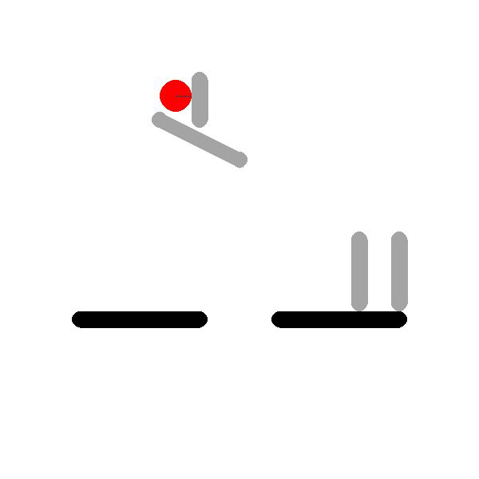
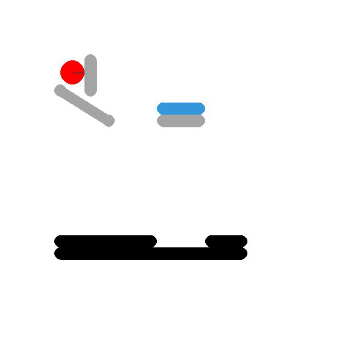
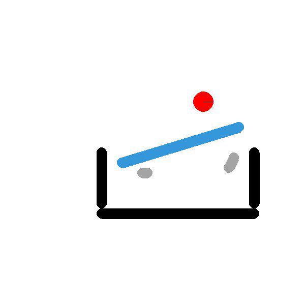
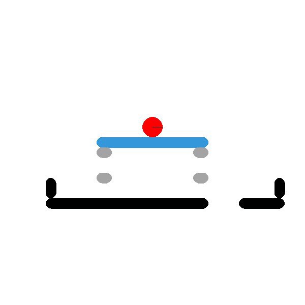

# IPHYRE
This is a project to explore **I**nteractive **PHY**sical **RE**asoning.

<p align="left">
    <a href='https://docs.google.com/presentation/d/1OKlC00aDkR0MthhsVOM7LSOSjqk3Htxw/edit?usp=sharing&ouid=102328237315023582126&rtpof=true&sd=true'>
      
    </a>
    <a href='https://docs.google.com/document/d/1Z3e2mT0AolBsJ7iLIp-K531QlIDqqAXhijRO1hB4Olw/edit?usp=sharing'>
      
    </a>
    <a href='https://www.youtube.com/watch?v=Ko2ZIc9YypY'>
      
    </a>
     <a href='https://lishiqianhugh.github.io/IPHYRE/'>
      
    </a>
    </a>
     <a href='https://github.com/viblo/pymunk'>
      
    </a>
</p>

<div align="center">
<kbd></kbd><kbd></kbd><kbd></kbd><kbd></kbd>
</div>

## Getting started
Run the command below to set the environment and install the packages required in this project.
```
conda create -n iphyre python=3.10
conda activate iphyre
pip install numpy pygame pymunk
pip install iphyre
```

## Package
We build the `iphyre` package to promote research on interactive physical reasoning. Follow [this instruction](./package/README.md) to call its APIs.

## Games
See the game list [here](https://lishiqianhugh.github.io/IPHYRE/). The parameters of different games are set in `iphyre.games`, which contains the vertices of the blocks and the central positions of the balls with radiuses. See the following structure for example:
```angular2html
'''
block: [[x1, y1],[x2, y2]] with a radius of 10
ball: [X, Y, Radius]
eli: 0/1 indicates whether the body can be eliminated
dynamic: 0/1 indicates whether the body can move under Newtonian laws

When designing, be careful about the following points:
1. the original point is at the left-top corner of the screen
2. when specifying the vertices of blocks, try to write from smaller numbers to larger numbers
3. the number of blocks equals to the number of eli and the number of dynamic.
'''

game_paras = {'support':
                  {'block': [[[200., 400.], [300., 400.]],
                             [[200., 500.], [300., 500.]]],
                   'ball': [[250., 340., 20.]],
                   'eli': [1, 1, 0],
                   'dynamic': [0, 0, 1],
                   },
              'hinder':
                  {'block': [[[200., 400.], [500., 400.]],
                             [[450., 300.], [450., 380.]],
                             [[500., 300.], [500., 380.]],
                             [[200., 150.], [300., 200.]]],
                   'ball': [[250., 100., 20.]],
                   'eli': [0, 1, 1, 1, 0],
                   'dynamic': [0, 0, 0, 0, 1],
                   },
              }
```
