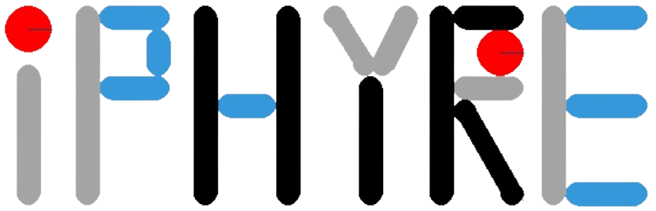
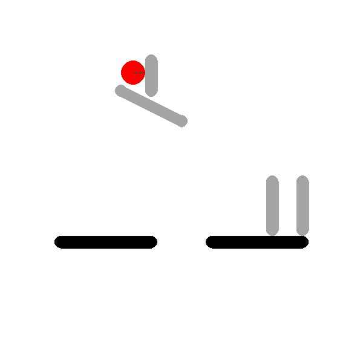
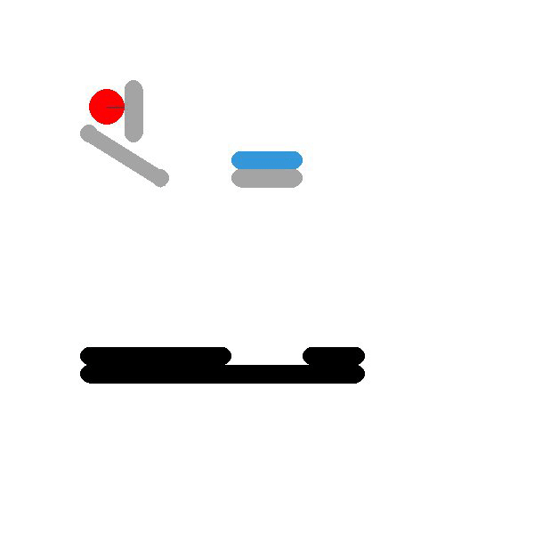

#  IPHYRE
This is a project to explore **I**nteractive **PHY**sical **RE**asoning.

<p align="left">
     <a href='https://arxiv.org/abs/2312.03009'>
      
    </a>
     <a href='https://lishiqianhugh.github.io/IPHYRE/'>
      
    </a>
    <a href='https://pypi.org/project/iphyre/'>
      
    </a>
    <a href='https://vimeo.com/793260764/2f77f9d5cb'>
      
    </a>
    <a href='https://www.youtube.com/watch?v=Ko2ZIc9YypY'>
      
    </a>
</p>

<div align="center">
<kbd></kbd><kbd></kbd><kbd></kbd><kbd></kbd>
</div>

## Getting started
Run the commands below to set the environment and install the packages required in this project.
```
conda create -n iphyre python=3.10
conda activate iphyre
pip install numpy pygame==2.1.2 pymunk ray
pip install iphyre
```

## Easy-to-use package
We build the `iphyre` package to promote research on interactive physical reasoning.

The following shows how to define and play a game:
```
from iphyre.simulator import IPHYRE

env = IPHYRE(game='hole')
env.play()
```

You can get names and configurations aof all 40 games by `GAMES` and `PARAS`:
```
from iphyre.games import GAMES, PARAS
```
We integrate the games into Gym with three planning strategies in [`IPHYREEnv.py`](./IPHYREEnv.py) to enable training advanced RL agents using [`Ray RLlib`](https://docs.ray.io/en/latest/rllib/index.html). See [`train_online_RL.py`](./train_online_RL.py) for details. You can run this .py file using:
```
python train_online_RL.py --strategy inadvance --model PPO --lr 1e-6 
```
Checkpoints are [here](https://drive.google.com/file/d/1R_7rCtV_xFJ5-XSp8I--9FxeKyuBfft0/view?usp=sharing).

If you are running a customized RL agent, you may want to obtain the intermediate states like this:
```
from iphyre.simulator import IPHYRE

max_iter = 150
model = DQN()  # define your own model
env = IPHYRE(game='hole')
s = env.reset()
while iter < max_iter:
    # get the action (clicking coordinate [x, y]) based on the current state
    a = model.get_action(s)
    # get next state by executing action a; set use_image=True if using visual state.
    s_, r, done = env.step(a)
    s = s_
```

If you want to generate some successful and failed actions and collect some offline data, you can call the corresponding APIs like this:
```
from iphyre.games import MAX_ELI_OBJ_NUM
from iphyre.utils import generate_actions
from iphyre.simulator import IPHYRE

succeed_list, fail_list, _ = generate_actions(game='hole',
                                              num_succeed=1,
                                              num_fail=1,
                                              interval=0.1,
                                              max_game_time=15.,
                                              max_action_time=7.,
                                              max_step=MAX_ELI_OBJ_NUM,
                                              seed=0)

env = IPHYRE(game='hole')

# save the initial data and image
env.collect_initial_data(save_path='./game_initial_data/')

# build executable action list
positions = env.get_action_space()
act_lists = []
for a in succeed_list + fail_list:
    act_lists.append([positions[i + 1] + [a[i]] for i in range(MAX_ELI_OBJ_NUM)])

# run actions and save the sequential data and images
env.collect_seq_data(save_path='./game_seq_data/', act_lists=act_lists)
```

[//]: # (## Baselines)

[//]: # (We utilize [ray [rllib]]&#40;https://docs.ray.io/en/latest/rllib/index.html&#41; to implement the model-free RL baselines including PPO, A2C, SAC, DQN, and DDPG. We also evaluate model-based [World Model]&#40;https://arxiv.org/pdf/1803.10122.pdf&#41; and offline [Decision Transformer]&#40;https://github.com/kzl/decision-transformer&#41; on our benchmark.)

## API
Some useful APIs are provided in `iphyre`.
* **iphyre.games.GAMES:** Get the names of all the games.
* **iphyre.games.PARAS:** Get the design parameters of all the games.
* **iphyre.simulator.IPHYRE.reset():** Reset the bodyies in the game and return the initial state.
* **iphyre.simulator.IPHYRE.step():** Apply an action and forward a timestep. Return the next state, reward and whether the game is finished.
* **iphyre.simulator.IPHYRE.simulate():** Simulate the game with the specified actions and only return the final results without a UI.
* **iphyre.simulator.IPHYRE.simulate_vis():** Simulate the game with the specified actions and display in a UI.
* **iphyre.simulator.IPHYRE.play():** Play the game in a UI with mouse clicks to eliminate blocks.
* **iphyre.simulator.IPHYRE.collect_initial_data():** Save images and body properties of only initial states without a UI.
* **iphyre.simulator.IPHYRE.collect_seq_data():** Save raw data, actions and body properties of the dynamic state sequence without a UI.
* **iphyre.simulator.IPHYRE.collect_while_play():** Save player's actions and rewards after playing with a UI.
* **iphyre.simulator.IPHYRE.get_action_space():** Get the central positions of the eliminable blocks with `no_action` at the first place and at the padding place.
* **iphyre.utils.generate_actions():** Random generate successful and failed actions of specifc numbers in one game.
* **iphyre.utils.play_all():** play all the games.
* **iphyre.utils.collect_initial_all():** Save images and body properties of initial states in all the games.
* **iphyre.utils.collect_play_all():** Play and save player's actions and rewards in all the games.

## Customize your games
See our game display for example [here](https://lishiqianhugh.github.io/IPHYRE/). The parameters of different games are set in `iphyre.games`, which contains the vertices of the blocks and the central positions of the balls with radiuses. See the following structure for example:
```angular2html
'''
block: [[x1, y1],[x2, y2]] with a radius of 10
ball: [X, Y, Radius]
eli: 0/1 indicates whether the body can be eliminated
dynamic: 0/1 indicates whether the body can move under Newtonian laws

When designing, be careful about the following points:
1. the original point is at the left-top corner of the screen
2. when specifying the vertices of blocks, try to write from smaller numbers to larger numbers
3. the number of blocks equals to the number of eli and the number of dynamic.
'''

game_paras = {'support':
                  {'block': [[[200., 400.], [300., 400.]],
                             [[200., 500.], [300., 500.]]],
                   'ball': [[250., 340., 20.]],
                   'eli': [1, 1, 0],
                   'dynamic': [0, 0, 1],
                   },
              'hinder':
                  {'block': [[[200., 400.], [500., 400.]],
                             [[450., 300.], [450., 380.]],
                             [[500., 300.], [500., 380.]],
                             [[200., 150.], [300., 200.]]],
                   'ball': [[250., 100., 20.]],
                   'eli': [0, 1, 1, 1, 0],
                   'dynamic': [0, 0, 0, 0, 1],
                   },
              }
```
You can easily create your own games baesd on the rules and structures above!
